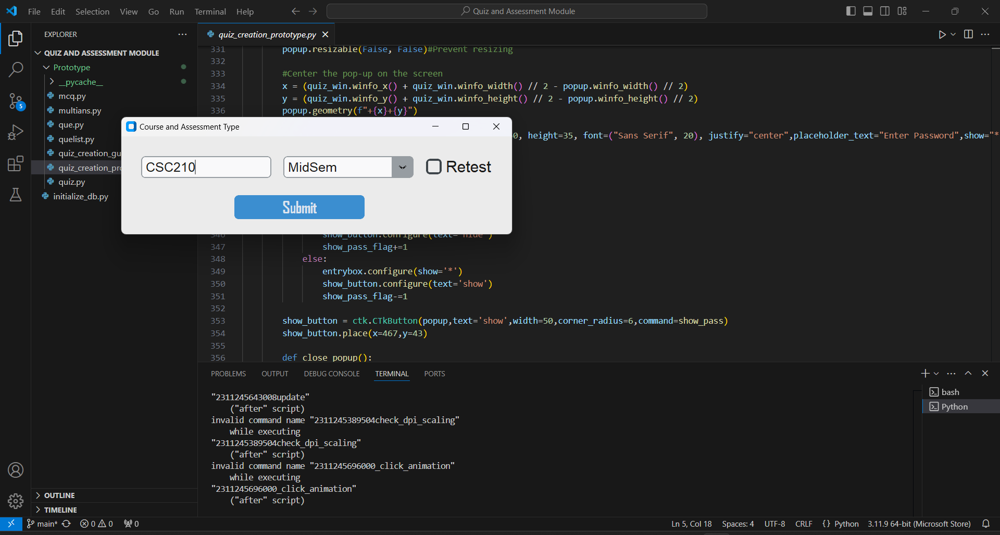
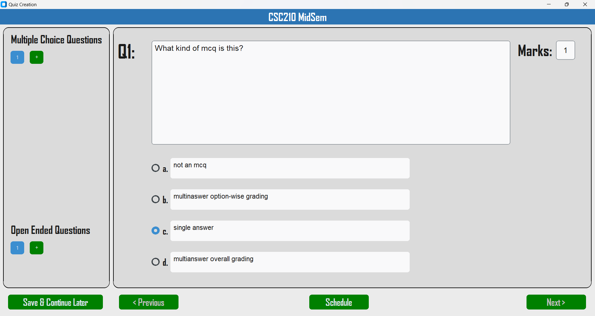
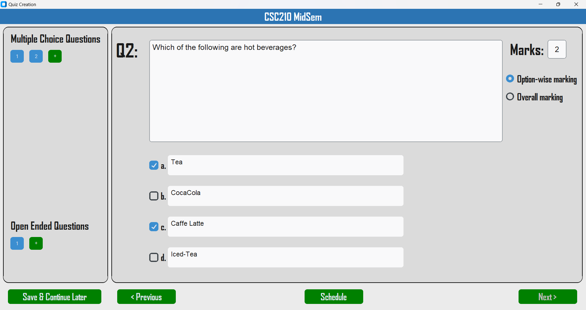
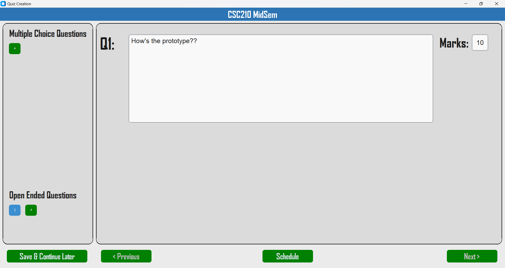
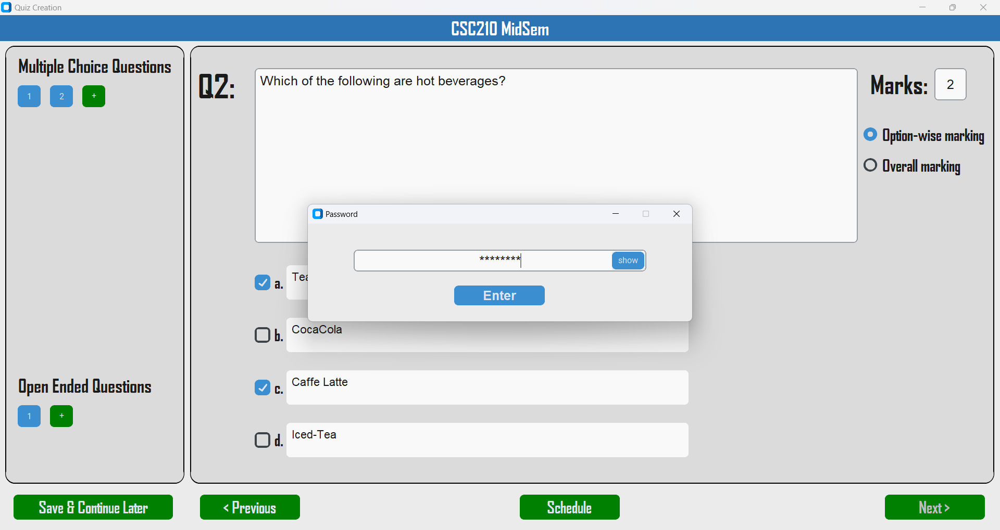
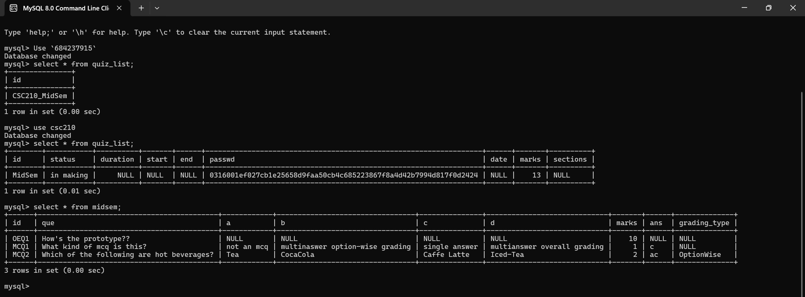

# Python GUI Quiz and Assessment Module (Prototype)

This is a prototype of a Python-based GUI application for quiz and assessment management. The current version includes only the **quiz creation** module — allowing professors to build quizzes with multiple-choice and open-ended questions.

## 🚧 Project Status

> 🛠️ **Prototype Stage**  
> This version focuses only on the **quiz creation** module. Features like quiz-taking, grading, and analytics will be added in future iterations.

## ✨ Key Highlights

- 🧱 **Clean OOP Architecture**: Modular class-based design with inheritance for different question types.
- 📦 **Efficient Data Structures**:  
  - Doubly Linked List for seamless question navigation  
  - HashSet for fast access and retention of checkbox states  
- 🗃️ **MySQL Database Integration**: Structured storage of quizzes, questions, users, and results.
- 🔐 **Secure Quiz Access**: Passwords are hashed using **SHA-256** before being stored.
- 💡 **User-Friendly GUI**: Built with `CustomTkinter`, featuring dynamic question addition, error handling, and save-progress options.

## 🧰 Technologies Used

- Python 3  
- [CustomTkinter](https://github.com/TomSchimansky/CustomTkinter)  
- MySQL + MySQL Connector for Python  
- `hashlib`, `ctypes` for security & native system interaction  

## 🚀 Getting Started

1. **Clone the repository**:
   ```bash
   git clone https://github.com/Madhav-M-Malhotra/python-gui-quiz-and-assessment-module.git
   ```

2. **Navigate to the folder**:
   ```bash
   cd python-gui-quiz-and-assessment-module
   ```

3. **Install dependencies**:
   ```bash
   pip install customtkinter mysql-connector-python
   ```

4. **Run the app**:
   ```bash
   python main.py
   ```

## 🧠 Architecture Overview

### 📦 Object-Oriented Design

- `Quiz` class — Stores metadata like subject, exam type, total marks
- `Que` base class — Defines common attributes for all questions
- `MCQ`, `MultiAns` — Inherit from `Que` and handle single/multi-answer questions
- `QueList` — Implements a **Doubly Linked List** for navigating questions
- `Quiz` object maintains two lists:
  - One for MCQs
  - One for Open-Ended Questions (OEQs)

### 🧮 Data Structures Used

- **Doubly Linked List** for forward/backward traversal of questions.
- **HashSet** for tracking selected answers in multiple-answer MCQs.
- **Database Tables** for:
  - Quiz list and metadata
  - Question papers
  - Section-wise student lists
  - Retests and answer sheets

### 🛡️ Security Measures

- Passwords are hashed using **SHA-256** before being saved to the database.
- GUI has built-in validations and error messages for incomplete or invalid inputs.

## 📸 Screenshots (UI Preview)

Below are visuals from the quiz creation prototype as presented in the project report:

| Quiz Setup Interface | MCQ: Single Correct | MCQ: Multiple Correct |
|---------------------|---------------------|------------------------|
|  |  |  |

| Open-Ended Question | Password Prompt | MySQL Database View |
|---------------------|------------------|----------------------|
|  |  |  |

## 📌 Features Snapshot

- ➕ Add up to **45 MCQs** and **10 OEQs**
- ✍️ Choose between **Single** and **Multiple** correct options
- ⚙️ Grading flexibility: Option-wise or Overall
- 🔁 Navigate with previous/next buttons (DLL-based)
- 💾 "Save & Continue Later" functionality
- 🔑 Password-protected scheduling

## 🗂️ Folder Structure

```
📁 python-gui-quiz-and-assessment-module/
├── main.py                # Entry point for GUI
├── quiz.py                # Quiz class definition
├── que.py                 # Base question class
├── mcq.py                 # MCQ & MultiAns classes
├── quelist.py             # Doubly Linked List logic
├── assets/                # Images/screenshots folder
└── README.md              # You're reading it!
```

## 📃 License

This project is licensed under the Apache License 2.0. See the [LICENSE](LICENSE) file for more details.

---

> 📚 *Developed as a part of the CSC210 - Data Structures & Algorithms course project.*
>  
> 👨‍💻 **Team Members**:  
> Bharvi Vaishnav • Madhav Malhotra • Sachin Yadav
